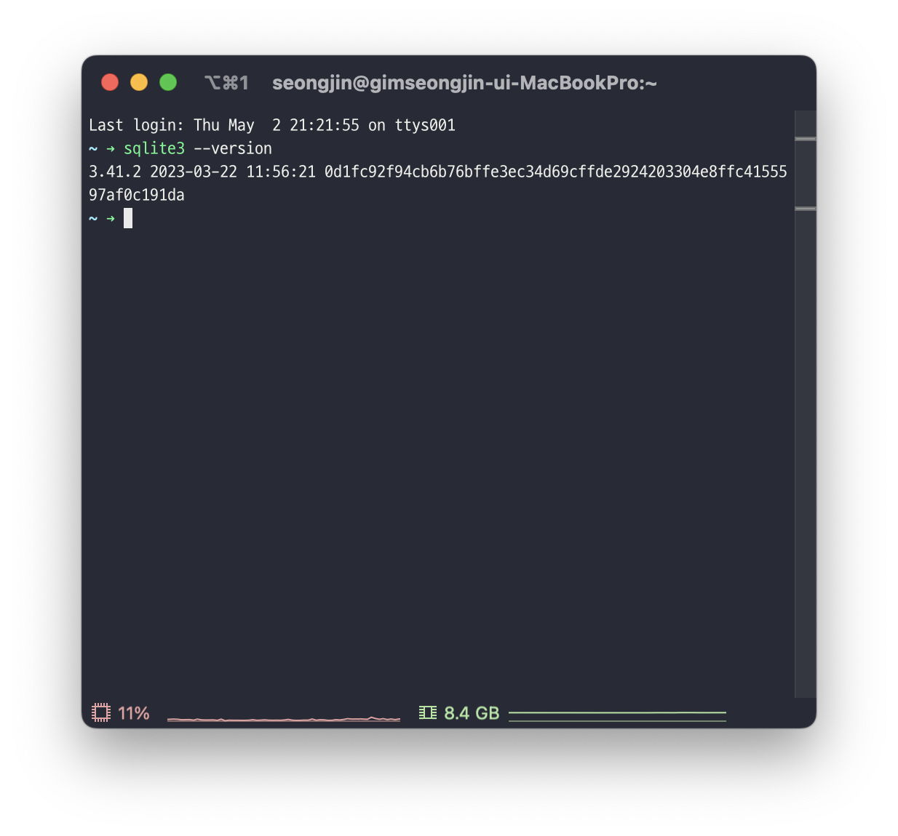

$$
\huge {\textsf {SQLite를 C++에서 사용하는 방법}}
$$

```
제작취지
SQLite를 c++에서 사용하는 방법을 초등학교 5학년이 보고 따라 할 수 있도록 만들었다.

환경
OS: macOS Sonoma
IDE: Xcode version 15.3 (15E204a)
```

# **`SQLite`**

# SQLite 설치

1. brew를 이용하여 설치

```bash
brew install sqlite3
```

1. 확인

```
sqlite3 --version
```



# 데이터베이스 생성

 다음 명령을 사용하여 `my.db`라는 이름의 데이터베이스를 만든다.

```sql
sqlite3 my.db
```

## 사진

# 테이블 생성

데이터베이스가 생성되면 다음 SQL 쿼리를 사용하여 `people`이라는 이름의 테이블을 만든다.

```sql
CREATE TABLE people ( /* 이름이 "people"인 테이블(릴레이션) 생성 */

    id INTEGER PRIMARY KEY AUTOINCREMENT, /* id속성을 기본키로 지정, 자동으로 증가하는 속성(열)로 직접 대입할 수 없음 */

    name TEXT NOT NULL, /*널값을 혀용하지 않음*/

    phone_number TEXT NOT NULL /*널값을 혀용하지 않음*/

);
```

```sql
.table /* 테이블 확인 */
.head on /*속성(열) 이름 표시*/
```

## 사진

# 데이터 삽입

다음 SQL 쿼리를 사용하여 데이터를 `people` 테이블에 삽입한다.

```sql
INSERT 

INTO people (name, phone_number) /*'people'테이블의 name, phone_number 속성(열)에 삽입*/

VALUES

    ('홍길동', '010-1234-5678'),

    ('김철수', '011-2345-6789'),

    ('박영희', '012-3456-7890');
```

## 사진

# 데이터 조회

다음 SQL 쿼리를 사용하여 `people` 테이블의 모든 데이터를 조회합니다.

```sql
SELECT * FROM people; /*'people'테이블의 모든 속성(열) 선택*/
```

## 사진

# 데이터 수정

 다음 SQL 쿼리를 사용하여 `people` 테이블의 데이터를 수정한다.

아래 쿼리는 ID가 2인 사람의 이름을 "이순신"으로, 전화번호를 "013-4567-8901"로 변경한다.

```sql
UPDATE people

SET name = '이순신',

    phone_number = '013-4567-8901'

WHERE id = 2;
```

## 사진

# 데이터 삭제

다음 SQL 쿼리를 사용하여 `people` 테이블의 데이터를 삭제한다.

아래 쿼리는 ID가 3인 사람의 데이터를 삭제한다.

```sql
DELETE FROM people

WHERE id = 3;
```

## 사진(없음)

# **`SQLite in C++`**

# Xcode에서 라이브러리와 바이너리 연결 설정

[프로잭트이름].xcodeproj → Build Phases → Link Binary With Libraries → 
libsqlite3.tbd, libsqlite3.0.tbd 선택

## 사진

# C++로 모든 속성(열)을 조회하는 코드

```cpp
#include <iostream>
#include <sqlite3.h>
#include <string>
using namespace std;

int error(char* message, sqlite3* db){
    cerr << message << sqlite3_errmsg(db) << endl;
    sqlite3_close(db); // 데이터베이스 연결을 끊고 자원 할당 해제한다.
    return 1;
}

// 데이터베이스를 여는 함수
void is_open(sqlite3** db, const char* dbPath){
    int rc; // rc(return code): 작업의 성공여부를 나타냄
   
    rc = sqlite3_open(dbPath, db); 
    if(rc)
        error("데이터베이스 열기 실패", *db);
    
    else
        cout << "데이터 베이스 열기 성공" << endl;
}

//callback(data, 차수(속성의 개수), char형 포인터 변수(C 스타일 문자열) 배열, char형 포인터 변수(C 스타일 문자열) 배열)
static int callback(void* data, int argc, char** argv, char** azColName) {
    for (int i = 0; i < argc; i++) {
		    // 속성의 이름: 속성 값 을 모든 카디널리티 만큼 출력
		    // (NULL이 아니면 값 출력 NULL이라면 "NULL" 출력)
        cout << azColName[i] << ": " << (argv[i] ? argv[i] : "NULL") << endl;
    }
    cout << endl;
    return 0;
}

void exec_query(sqlite3* db, const char* query){
    int rc; // rc(return code): 작업의 성공여부를 나타냄
    char* error_message = nullptr;
    
    /*
     sqlite3_exec(sqlite3 *, const char* sql, int(*callback)(void*, int, char **, char**),
     void*, char** errmsg)
     */
    rc = sqlite3_exec(db, query, callback, 0, &error_message);
    
    if(rc != SQLITE_OK){
        cerr << "SQL error: " << error_message << endl;
        sqlite3_free(error_message); // 메모리 할당 해제하고 오류 메시지를 출력한다.
    }
    else
        cout << "성공적으로 쿼리가 실행되었습니다." << endl;
}

int main() {
    sqlite3* db; // 데이터베이스 객체 포인터로, 핸들러이다.
    string dbPath = "/Users/seongjin/sqlite3/my.db"; // 데이터베이스 절대경로
    const char* query = "SELECT * FROM people"; // query문
    
    is_open(&db, dbPath.c_str()); // &db(sqlite**), c.str(const char* 형태로 반환)
    exec_query(db, query); //query를 실행한다.
    sqlite3_close(db); // 데이터베이스 연결을 끊고 자원 할당 해제한다.
    
    return 0;
}
```

## 사진

# `과제코드`

```cpp
#include <iostream>
#include <sqlite3.h>
#include <string>
using namespace std;

// 점수를 저장할 구조체 s1
struct {
    int totalKor = 0;
    int totalMath = 0;
    int studentCount = 0;
}s1;

// 카디널리티 만큼 자동 반복
static int callback(void* data, int argc, char** argv, char** azColName) {
    int korScore = atoi(argv[2]);
    int mathScore = atoi(argv[3]);
    int sum = korScore + mathScore;
    double avg = sum / 2.0;
    
    cout << "학생 ID: " << argv[0] << ", 이름: " << argv[1] << endl;
    cout << "국어 점수: " << korScore << ", 수학 점수: " << mathScore;
    cout << "총점: " << sum << ", 평균: " << avg << endl << endl;
    
    s1.totalKor += korScore;
    s1.totalMath += mathScore;
    s1.studentCount++;
    
    return 0;
}

int error(char* message, sqlite3** db){
    cerr << message << sqlite3_errmsg(*db) << endl;
    sqlite3_close(*db);
    return 1;
}

void is_open(sqlite3** db, const char* dbPath){
    int rc; 
    
    // 데이터베이스 열기
    rc = sqlite3_open(dbPath, db);
    if(rc)
        error("데이터베이스 연결 실패: ", db);
    else
        cout << "데이터 베이스 열기 성공" << endl;
}

void exec_query(sqlite3* db, const char* query){
    int rc;
    char* error_message = nullptr;
    
    /*
     sqlite3_exec(sqlite3 *, const char* sql, int(*callback)(void*, int, char **, char**),
     void*, char** errmsg)
     */
    rc = sqlite3_exec(db, query, callback, 0, &error_message);
    
    if(rc != SQLITE_OK){
        cerr << "SQL error: " << error_message << endl;
        sqlite3_free(error_message);
    } else{
        cout << "성공적으로 쿼리가 실행되었습니다." << endl;
        cout << "국어 총점: " << s1.totalKor << ", 평균: " << (double)s1.totalKor / s1.studentCount << endl;
        cout << "수학 총점: " << s1.totalMath << ", 평균: " << (double)s1.totalMath / s1.studentCount << endl;     
    }
               
}

int main() {
    sqlite3* db; 
    string dbPath = "/Users/seongjin/sqlite3/sj.db"; 
    const char* query = "SELECT * FROM grade"; 
    
    is_open(&db, dbPath.c_str()); 
    exec_query(db, query);
    sqlite3_close(db);
    
    return 0;
}
```

## 사진

# `과제소감`

ChatGPT를 이용하여 코드를 생성하는 방법을 익힐 수 있었습니다.

객체 지향 분석 및 설계 과목에서 학습하고 있는 기법인 리팩토링을 이용하여 코드를 리팩토링해 볼 수 있었습니다.

또한 데이터 처리 언어인 SQL을 복습할 수 있었습니다.

학습했던 여러 과목을 합쳐 실습해 볼 수 있는 의미 있는 과제였습니다.

프로젝트에 대한 자신감이 조금 더 생긴 것 같습니다.
